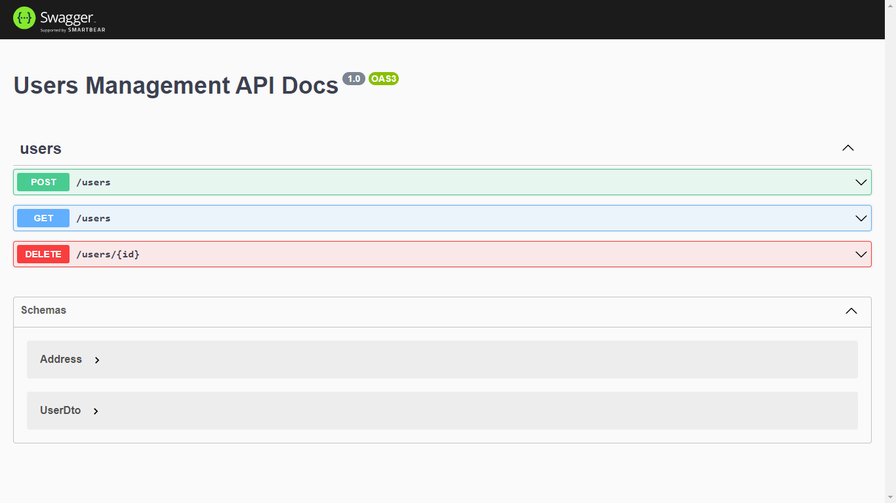

# Userman Project

### Welcome to Userman, a very easy to use user manager 😀

## Technologies used

### Frontend
- ReactJs Vite
- Typescript
- Chakra UI
- Emotion CSS
- Phosphor Icons
- Toastfy
- Axios
- React Hook Forms

### Backend
- NodeJs
- Typescript
- NestJs
- SQLite
- Swagger
- Prisma ORM
- Validations
___

## Prerequisites
- NodeJs 16
- Yarn
___

## How to use?

## Step 1
The first step is to download the project, for this you can copy the code below and run it in your GIT terminal

```
https://github.com/gabrielbugarelli/userman-project.git
```
____

## Step 2
### FRONTEND
Now, with NodeJs installed, just access the directories:
**/userman-frontend** and run the command
```
yarn install
```

### BACKEND
The same goes for the backend, you need to access the 
**/userman-frontend** directory and the yarn install command.
```
yarn install
```
____

## Step 3
### Running the project
Now inside the respective directories,
just run the command **yarn dev** in each of the directories to raise the server **frontend** && **backend** and be happy!!! 😀🚀

**/userman-frontend** AND
**/userman-backend**
```
yarn dev
```
___

## Swagger
After raising the project's backend server, you can access the link http://localhost:3333/ and access the Swagger documentation. 😀🚀

<div width="100%" align="center" styles="display:flex; flex-direction:row;"> 
	
  	
</div>
